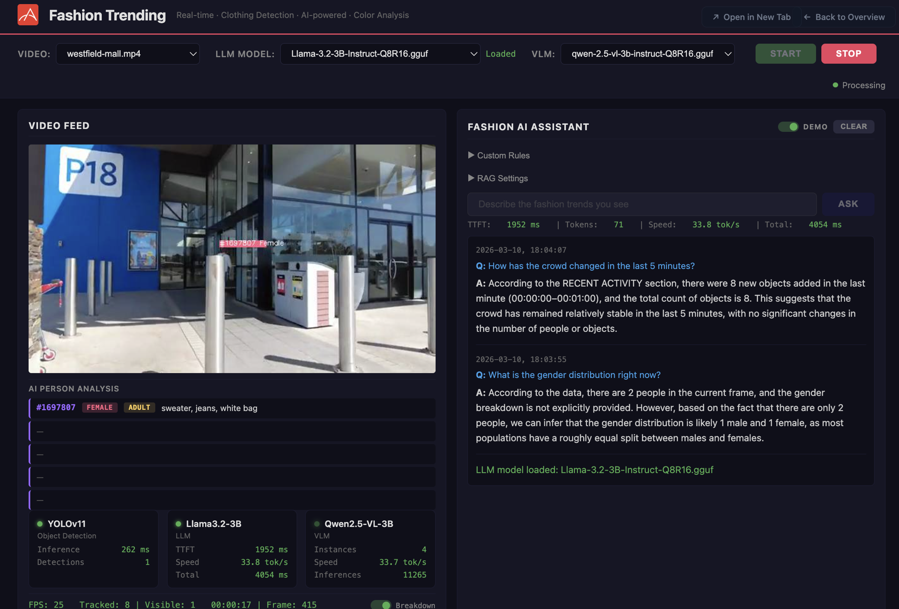
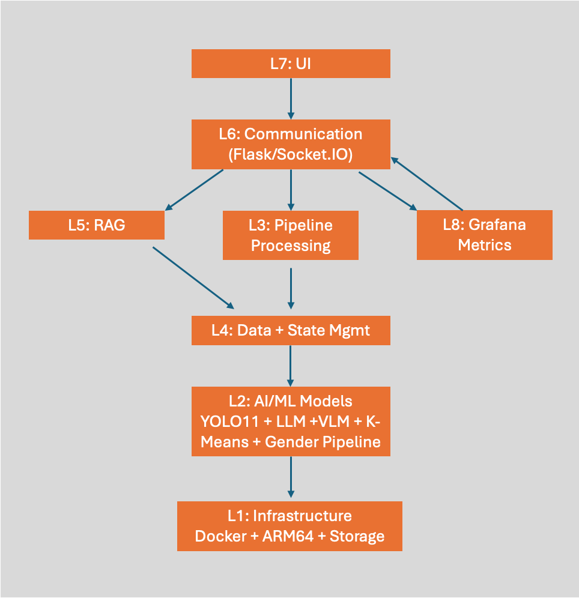

# Fashion Trend Analysis- Multimodal
## User Interface
This is a real time fashion analytics platform - YOLOv11 detects people in video, a VLM (Qwen 2.5-VL) classifies each person’s gender/age/hair/clothing, and K-means extracts clothing colors.  A Llama-32.-3B LLM answers fashion questions over the live tracking data via RAG.
The Flask/SocketIO UI shows the video feed with gender-colored labels, live person analysis, breakdown charts, and a chat assistant.  Optimized for Arm64 Ampere processor, auto-loads models and auto-starts a demo video.



## Architectural Diagram
This demo runs a multi-threaded Flask/SocketIO pipeline where a video reader feed YOLOv11 via an asynchronous queue, with separate workers for VLM inference.  The VLM layer spawns 5 parallel llama-server subprocesses, each pinned to 16 CPU cores via task set, classifying gender/age/hair/clothing through  layer of pipeline. K-Means extracts clothing colors.  All feed to RAG context. 


## What This Demo Shows
This demo shows real-time fashion analytics on video: as people walk through the frame, YOLOv11 detects and tracks them while a VLM classifies each person’s gender, age group, hair length, clothing styles, and clothing colors - displayed as live labels over the video, and aggregated into breakdown charts.
Alongside, a Fashion AI Assistant chat panel lets you ask natural-language questions about what’s been seen, powered by a local Llama-3.2-3B LLM with RAG context built from the live tracking data.  The demo has demo mode auto-cycles 15 shuffled fashion questions, and a system monitor shows CPU/memory and per-model status (YOLO/LLM/VLM) - all running on a single Arm64 Ampere server with 5 parallel VLM instances.

## Target Audience
- Retail and Fashion Industry
   - Store operations managers - analyze foot traffic demographics to optimize staffing, product placement
   - Visual merchandiser - track which clothing colors/styles customers actually wear vs. what’s displayed 
   - Fashion buyers and merchandise planners- validate trend assumptions with real world data on what demographics wear 
   - Marketing teams - measure campaign impact by tracking demographics shifts in store visitors after promotions.
- Shopping Mall and Commercial Estate
   - Mall operators - understand visitor demographics per zone for leasing decision.
- Smart City and Public Sector
   - Event organizers- crowd composition at festivals, concerts, exhibitions for safety planning 
   - Tourism - visitor profile analysis at landmarks and attractions
- AI/ML Infrastructure Buyers 
   - Edge AI integration- system integrators building on-premise vision analytics
   - Enterprise architect - evaluate local LLM + VLM deployment for vertical applications on Ampere processors.
- Security and Loss Prevention
   - Retail security teams - descriptive suspect search
   - Asset tracking - backpack/handbag/suitcase detection for lost-item recovery or unattended bag alerts
- Developers and Technical Evaluators
   - Computer vision engineering- reference architecture for multi-model pipelines (YOLO + VLM + LLM)
   - Solution architects - demo to show clients what’s achievable with open source models on Arm64 processors.

## Key Message - What are we trying to convince of?
**Core message**
A single Arm64 CPU server runs production grade, multi models, real time AI vision, LLM workloads locally, observably with out a GPU.
- Ampere processors are the right CPUs platforms for AI inference
   - This demo exists to prove Ampere can host the workloads people assume require GPUs.
   - The whole stack is tuned for Ampere.
- You don’t need GPUs for production AI vision workloads
   - A single Arm64 CPU server run YOLOv11, multiple VLM instances, and LLM simultaneously in real time
   - Q816 quantization delivers GPU class inference economics on Ampere hardware.
   - Rethink your AI infrastructure budget - CPU inference is viable today
- Multi-modal AI pipelines are practical, not just research demos
   - 3 different model families (detector + VLM + LLM) coordinate in one application with sub-second latency
   - Proves that the “compound AI system” pattern works 
   - Stop thinking ofAI as one model per use case - orchestrate multiple specialized models.
- Local/on-premise AI is fully capable 
   - Everything runs in docker container
   - Local inference is no longer a compromise vs. cloud APIs.
- Vision language models unlock structured insight from raw video
   - VLM extracts descriptive attributes that classical CV can’t do
   - Show how to make VLM outputs reliable in production.
- RAG works on live operational data, not just documents
   - LLM answers fashion questions grounded in real-time tracking state, not a static knowledge base.
   - Show how to engineer context windows for live data.
- Open source models are enterprise ready
   - Llama-3.2-3B, Qwen2.5-VL-3B, and YOLOv11 are all open source and can run locally
   - Competitive with proprietary APIs for vertical use cases at a fraction of the cost
   - Open models + smart engineering  > closed API dependency.
- Real time fashion/retail analytics is a solved problem now
   - Demographics, clothing trends, and natural language store intelligence - all from existing camera feeds
   - No specialized hardware, no model training.
   - Retail decision makers can deploy this class of analytics now.


--------------------
# fashion-trend-docker
### Getting Started
1. **Download** the Ampere optimized model from [Hugging Face](https://huggingface.co).
2. - Llama-3.2-3B-Instruct-Q8R16.gguf
   - qwen-2.5-vl-3b-instruct-Q8R16.gguf
   - mmproj-qwen-2.5-vl-3b-instruct-Q8_0.gguf
3. **Place** the model inside the `models/` directory.
4. **Place** the videos inside the `videos/` directory.
5. **Run** the setup script:
   ```bash
   ./start_app.sh

**The script** will pull the demo docker image from docker hub, setup the environments neccessary for this demo.

**Open** the demo at http://< your_ip_address >:8000
